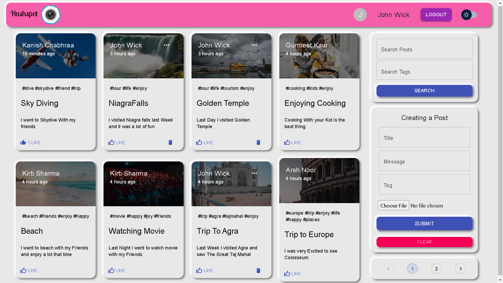

So I built  a React Application called Hashspot which work kind of like Instagram app . i tried to make it easy to use so aqnyone who dont have any knowledge aboutr the social media app can easily use the app without any difficulty .
 
Frontend: For frontend part i used two libraries first one is "Material Ui " and second one is "Bootstrap" which givces this app a very cool look and feel. The whole uiu is neumorphic which gives it a very minimilstic look on the other hand it also looks very eye catchy.

Backend: For backend part i used "Mongodb Atlas" which is a cloud database. You can also use "Mongodb Compass" which is also a good database but using a cloud database is always good and it is also easy to deploy. I used " Heroku" to deploy my backend .

The whole website is deployed on Heroku and Netlify .